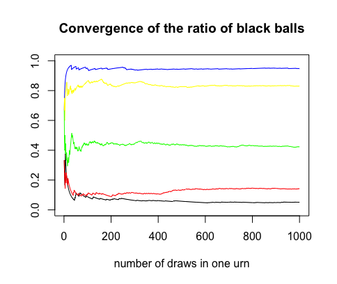

### What is a Pólya urn?

A Pólya urn model usually works like this: 

Start with an urn containing **a** black balls and **b** red balls initially.
At each draw, pull out a ball uniformly at random, and then return it to the urn with another ball of the same color. 
Count the number of black balls and get the ratio of black balls in the urn after n draws. 

### Long-term behavior of the Pólya urn

Suppose a Pólya urn has **a** = 1 black ball and **b** = 1 red ball initially. After n draws, there are n+2 balls in the Pólya urn. 
What is the ratio of black balls in the urn, for large n?

In 5 independent trials, the plot below records the changing ratio of black balls in the urn when n approaches 1000 in each trial. Each line, labeled in different colors, represents one trial. 

We can clearly see that in the first 100 draws, the ratio of black balls changes drastically.
But after 200 draws, the ratio "magically" becomes stable and converges to a limit. 

These 5 trials have the exact same initial conditions (**a** = 1, **b** = 1), but the limits to which each urn converges 
are very different. Let us speculate boldly and more generally, for each Pólya urn with the same initial conditions, is the ratio of black balls after a large 
number of draws random? If it is indeed random, can it possibly be associated with a known distribution?

It is a good idea to run many trials with the same initial conditions and discover the shape of a density from the resulting histogram.

### Asymptotic analysis of Pólya urns with the same initial conditions

In the 4 histograms below, we record the ratios of black balls after 1000 draws in 10,000 trials given 4 different sets of initial conditions.

The red curve represents the probability density function(pdf) of the corredponding Beta(a, b). (a = initial number of black balls; b = initial number of red balls)

In each graph, we can see that the overall shape of bins matches the pdf of the Beta(a, b).
Therefore, the graphs visualize how the ratio of black balls in the urn converges in distribution to the Beta distribution with the same parameters after a huge number of trials.

    
    

Reflecting on this conclusion, let's look back at the first plot. The limit generated by one trial is a simulation/sample from the corresponding Beta(a,b), which also explains why the limit is random.

### How is the Pólya urn model different from usual Markov chains? 

Since only one ball is added in each draw and the initial condition is known, we only need to keep track of the current number of black balls in the urn before the next draw. Each draw is independent of the past, so the Pólya urn model is a Markov chain but it is not time-homogeneous. That is, the transition probabilities depend on the number of draws that have happened before. Thus, the usual theory of invariant distributions for irreducible, aperiodic Markov chains does not apply. Meanwhile, a usual Markov chain converges to a limiting distribution (its stationary distribution) but a Pólya urn converges to a limit, which is a number instead of a distribution. 

### Additional Resources

[Wikipedia](https://en.wikipedia.org/wiki/Beta_distribution) has great resources for more details on Beta distribution.

[This website](http://ameroyer.github.io/projects/2019/09/09/PolyaUrn.html) has thorough information about the Pólya urn model and it has interactive posts to help visualize the simulation.

[View](https://github.com/celestezeng33/Polya_Urn/blob/gh-pages/polya_urn.R) the R code for the Pólya urn on GitHub.

Download the R codes [here](https://downgit.github.io/#/home?url=https://github.com/celestezeng33/Polya_Urn/blob/gh-pages/polya_urn.R) to change the initial numbers of black and red balls in the urn and generate different graphs. 
