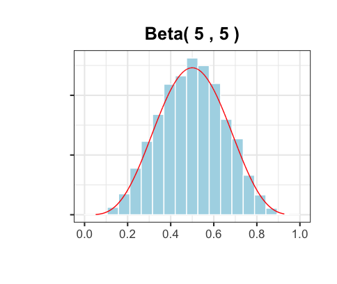
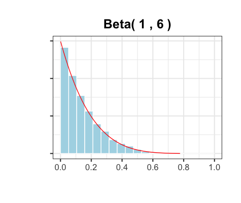

### What is a Pólya urn?

A Pólya urn model usually works like this: 

Start with an urn containing a black balls and b red balls initially.
At each draw, pull out a ball uniformly at random, and then return it to the urn with another ball of the same color. 
Count the number of black balls and get the ratio of black balls in the urn after n draws. 

### Long-term behavior of the Pólya urn

Suppose an Pólya urn has 1 black ball and 1 red ball initially. After n draws, there are n+2 balls in the Pólya urn. 
What is the ratio of black balls in the urn, for large n?

In 2 independent trials, the 2 plots below record the changing ratio of black balls in the urn when n approaches 1000. 

We can clearly see that in the first 100 draws, the ratio of black balls changes drastically.
But after 200 draws, the ratio magically becomes stable and converges to a limit. 

  

Both trials have the exact same initial conditions(1 black ball and 1 red ball), but the limits to which each urn converges 
are very different. Let us speculate boldly and more generally, for each Pólya urn with the same initial conditions, is the ratio of black balls after a large 
number of draws random? If it is indeed random, can it possibly be associated with a known distribution?

It is a good idea to generate a even greater number of Pólya urns the same initial conditions and record the ratios of black balls in them after 1000 draws.
Only by doing so can we discover its correlation with a specific distribution.

### Asymptotic analysis of Pólya urns with the same initial conditions

In the 4 histograms below, we record the ratios of black balls after 1000 draws in 10,000 trials given 4 diffrent sets of initial conditions.

The red curve represents the probability density function(pdf) of the corredponding Beta(a, b). 

(a = initial number of black balls; b = initial number of red balls)

In each graph, we can see that the overall shape of bins matches the pdf of the Beta(a, b).
Therefore, graphs visualize how the ratio of blakc balls in the urn converges in distribution to the Beta distribution with same parameters after a huge number of trials.

    
    

Reflecting on this conlusion, let's look back at the first 2 plots. The limit generated by one Polya urn is a simulation/sample from the corresponding Beta(a,b), which also explans why those limits are random.

Download the R codes [Here](https://downgit.github.io/#/home?url=https://github.com/celestezeng33/Polya_Urn_Model/blob/main/polya_urn.R) to change the initial numbers of black and red balls in the urn and generate different graphs. 
