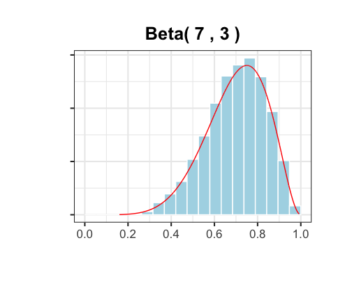

## Introduction

### A Pólya urn model usually works like this: 

Start with an urn containing a black balls and b red balls initially.
At each draw, pull out a ball uniformly at random, and then return it to the urn with another ball of the same color. 
Count the number of black balls and get the ratio of black balls after n draws. 

## Long-term behavior of a single Pólya urn

Suppose an Pólya urn has 1 black ball and 1 red ball initially. After n draws, there are n+2 balls in the Pólya urn. 
What is the ratio of black balls in the urn, for large n?

In 2 independent trials, the 2 plots below record the changing ratio of black balls in the urn when n approaches 1000. 

We can clearly see that in the first 100 draws, the ratio of black balls changes drastically.
But after 200 draws, the ratio magically becomes stable and converges to a limit. 

Both trials have the exact same initial conditions(1 black ball and 1 red ball), but the limits to which each urn converges 
are very different. Let us speculate boldly and more generally, for each Pólya urn the same initial conditions, is the ratio of black balls after a large 
number of draws is random?

  

```markdown
Syntax highlighted code block

# Header 1
## Header 2
### Header 3

- Bulleted
- List

1. Numbered
2. List

**Bold** and _Italic_ and `Code` text

[Link](url) and 
```
    
    

Download the R codes [Here](https://downgit.github.io/#/home?url=https://github.com/celestezeng33/Polya_Urn_Model/blob/main/polya_urn.R) to change the initial numbers of black and red balls in the urn. 
